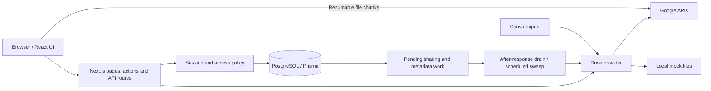

# Architecture

[← Project overview](../README.md)

Penn Players Hub stores the theatre company's document index and access model in PostgreSQL. Google Drive stores the files. The Next.js application connects the two and supplies a mock provider for local evaluation.

## Key paths

| Code | Responsibility |
| --- | --- |
| [`app/(app)/`](../app/(app)/) | Authenticated dashboard, documents, productions, categories, and administration |
| [`app/actions/`](../app/actions/) | Validated server-side mutations |
| [`app/api/`](../app/api/) | OAuth, uploads, synchronization status, and scheduled jobs |
| [`lib/access.ts`](../lib/access.ts) | Viewer context, list predicates, document visibility and creation rules |
| [`lib/auth.ts`](../lib/auth.ts) | Signed sessions, current-user lookup, role gates |
| [`lib/documents.ts`](../lib/documents.ts) | Document creation, registration, edits, versions, and provider coordination |
| [`lib/sharing.ts`](../lib/sharing.ts) | Queued reconciliation, versioning, leases, and background drains |
| [`lib/upload-client.ts`](../lib/upload-client.ts) | Browser upload state, chunk transfer, recovery, and finalization |
| [`lib/google/`](../lib/google/) | Real and mock Drive providers, OAuth, and resumable uploads |
| [`lib/canva/`](../lib/canva/) | Canva connection, export, and freshness checks |
| [`prisma/schema.prisma`](../prisma/schema.prisma) | Users, documents, productions, roles, shares, upload sessions, and operational state |
| [`scripts/`](../scripts/) | Local setup, metadata backup/restore, and Drive reconstruction |

## Access is contextual

Account roles define broad capabilities: `ADMIN` manages configuration, `BOARD` can create and edit, `MEMBER` has board-side reading access, and `COMPANY` relies on production memberships.

| Document visibility | Audience |
| --- | --- |
| Private | Enabled creator and explicit named recipients, subject to company membership restrictions |
| Board | Active board-side accounts: Admin, Board, and Member |
| Company | Board-side accounts plus eligible company members whose roles cover the category |

For a production document, a company user must belong to that production—even when they created the file or received a named share. Organisation-wide company files use the member's combined eligible role categories. Private documents do not automatically become visible to administrators.

A membership can hold multiple roles. Viewing access is the union of those roles' categories. Creation requires a creation-enabled role for the specific category; a creation grant in one category does not upgrade viewing access in another. Visibility and edit access are separate settings.

The same policy informs list queries and direct document access. Drive remains an independent permission system: owner access, inherited grants, and collaborators on registered files cannot all be controlled by the Hub.

## Document changes and reconciliation

Metadata edits are saved to PostgreSQL and mark the document for Drive reconciliation. Membership changes likewise queue affected documents. `after()` starts bounded work after the response, and scheduled sweeps retry pending work. Leases and version checks help prevent concurrent workers from treating stale results as current.

The UI can poll document sync and sharing progress endpoints. A successful Hub save means the Hub record changed; it does not guarantee that every external permission has already been applied. Operators should inspect pending work before relying on a Drive revocation.

## Resumable uploads

The server validates the actor and filing choices, then starts a provider upload session. The browser sends 8 MiB chunks directly to Google. On interrupted or ambiguous responses, recovery checks the acknowledged offset instead of assuming the last chunk failed. Finalization registers the uploaded file and supports retry without creating a second document.

The implemented ceiling is 20 GiB per recording. Mock uploads use a 4 MiB server path, so local screenshots and mock tests are not evidence of a live 20 GiB transfer. Google storage quota and provider permissions still apply.

## Operations and recovery

`/api/cron` coordinates recurring maintenance such as sharing reconciliation, Drive change tracking, Canva freshness, and the configured digest. The checked-in Vercel schedule runs daily; see [SETUP.md](../SETUP.md) for configuration and alternative scheduling.

Metadata backups preserve the Hub index and access configuration, not the underlying file bytes. They contain member information and belong outside Git. Drive `appProperties` and folder structure provide an additional reconstruction path through `npm run rebuild`.

## Verification scope

The repository includes access and membership regressions, mocked upload recovery tests, and endpoint integration harnesses. These cover application logic and failure cases, but cannot establish a deployment's live OAuth configuration, Google quota, or external sharing state. Evaluate those separately in a controlled connected environment.
