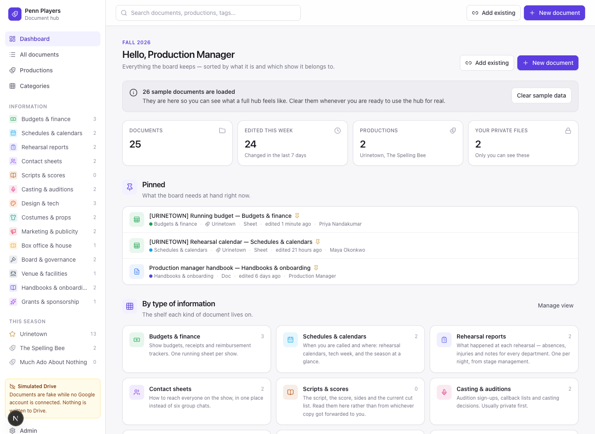
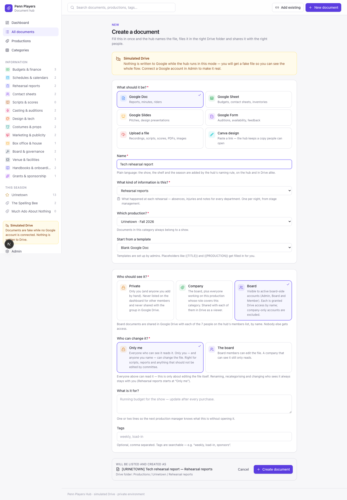
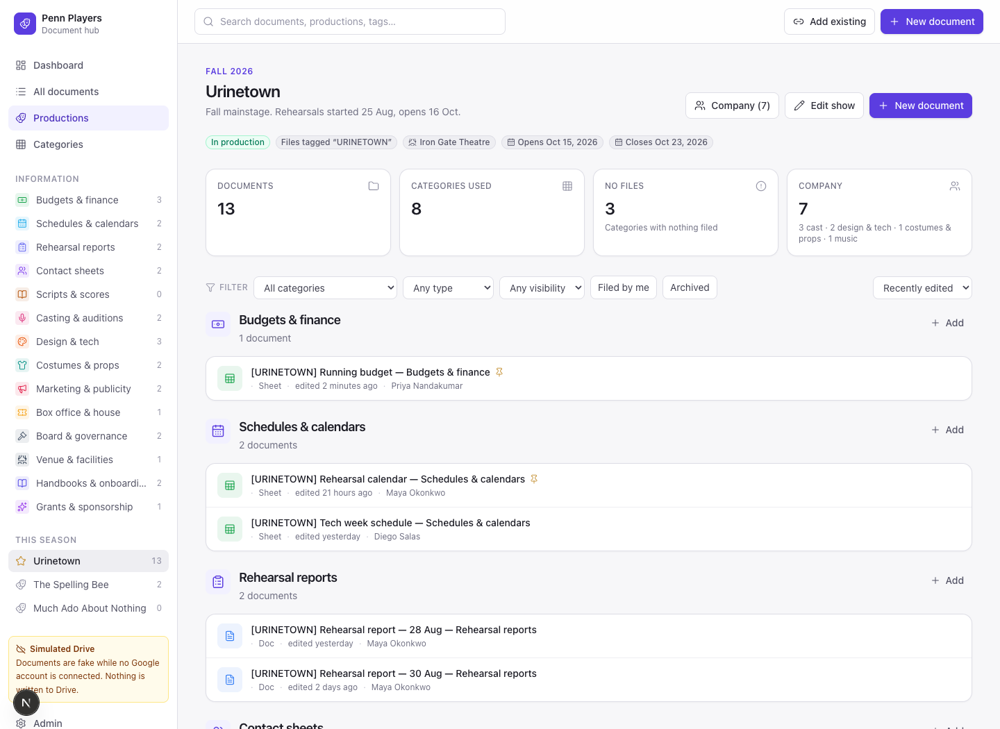
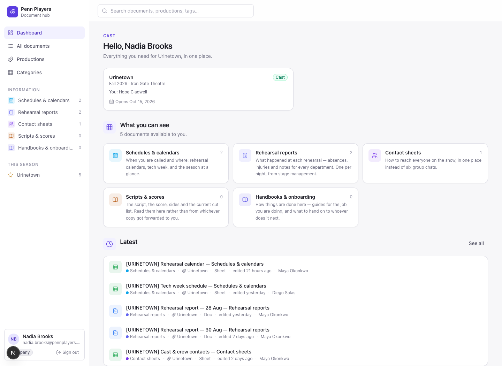

# Explore the app

[← Project overview](../README.md)

These are browser captures of the existing application at code revision `f271529`, taken on September 17, 2026. The app ran against a new local PostgreSQL database populated by `prisma/seed.ts`, with `DRIVE_MODE=mock` and `CANVA_MODE=mock`. No production database, student records, connected accounts, or real document contents were used.

The images show the actual UI, including its sample-data and simulated-Drive notices. Names are fictional seeded identities. Relative dates and counts will vary when you run the seed. Screenshots use a 1440 × 1050 browser viewport; the creation screen is a full-page capture. The Next.js development indicator is retained.

## Board dashboard

Sign in as **Production Manager** to see pinned documents, category navigation, production links, and the shared library.

## Create and file a document

Open **New document**, enter `Tech rehearsal report`, choose **Rehearsal reports**, and select **Urinetown**. The existing form exposes file type, visibility, edit access, and a naming preview. This screenshot shows the form before submission.

## Production overview

Open **Productions → Urinetown**. The production page groups files and shows filing coverage. Coverage reflects shared documents present in a category, rather than approval or task status.

## Company perspective

Sign out and choose **Nadia Brooks**, a seeded Cast member. The dashboard narrows to the member's production and permitted categories.

## Reproduce the captures

1. Follow the [local setup](../README.md#run-locally) using a fresh, dedicated development database. Keep Google and Canva credentials empty and use mock providers.
2. Start `npm run dev`, open the local URL, and select the seeded accounts described above.
3. Use a desktop browser viewport of 1440 × 1050. Capture the dashboard, production overview, creation form, and company dashboard after each page finishes loading.
4. Confirm the sample-data/simulated-Drive labels and inspect each image for personal data before committing it under `docs/screenshots/`.

To evaluate filing beyond the screenshots, submit a new demo document and open its simulated Drive page. To evaluate real Google permissions or recording uploads, use the separate connected setup in [SETUP.md](../SETUP.md).
